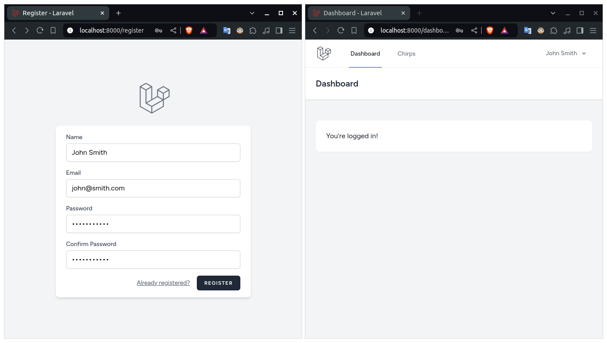
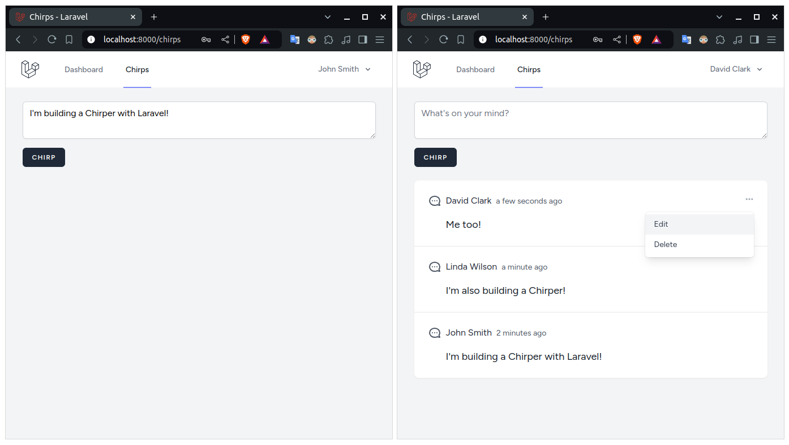

# Chirper

## Description

Chirper is a microblogging platform built with Laravel, React, Inertia, and Tailwind CSS. It allows users to create, view, edit, and delete posts with full authentication and features notifications for new Chirps, enhancing the interactive user experience. This project was developed as part of the Laravel Bootcamp, showcasing the effective integration of these technologies in a real-world application.

### Features

-   Authentication with secure login and user management
-   CRUD operations for creating, viewing, editing, and deleting posts
-   Email notifications for new Chirps
-   Responsive design optimized for both desktop and mobile devices

## Built With


## Visuals




## Installation

To get started with this project, follow the steps below:

1.  **Clone the repository**

    ```
    git clone https://github.com/cristianscheid/chirper.git
    cd chirper
    ```

2.  **Set up backend environment**

    -   Install dependencies

        ```
        composer install
        ```

    -   Set up environment variables

        ```
        cp .env.example .env
        ```

        > Open the `.env` file and configure your database and other settings (you can keep the default settings to use SQLite for simplicity)

    -   Generate application key

        ```
        php artisan key:generate --ansi
        ```

    -   Run database migrations

        ```
        php artisan migrate
        ```

3.  **Set up frontend environment**

    -   Install dependencies

        ```
        npm install
        ```

4.  **Start the servers**

    -   Backend

        ```
        php artisan serve
        ```

    -   Frontend
        ```
        npm run dev
        ```

## Usage

Once the application is running, you can access it at `http://localhost:8000`.
